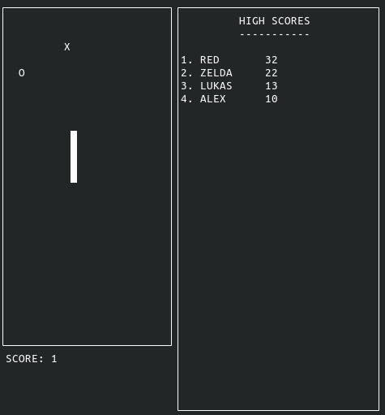

:author: Lukas Turcani

This is a simple snake game. The purpose of this was to create a game
I can use for reinforcement learning, see
https://github.com/lukasturcani/dnn, but the game can be played by
itself. The docs for this game are available at
https://ltsnake.readthedocs.io.

The game can be run from the command line with::

    $ git clone https://github.com/lukasturcani/snake
    $ cd snake
    $ python snake

but options are available too, for more details see::

    $ python snake --help

For example, the speed can be altered and walls can
be added to the level::

    $ python snake --speed 0.2 --walls 10 10 10 11 10 12 10 13 10 14

The game itself is completely decoupled from the IO. If you want to
only run snake in a loop and interact with it programatically,
for example if you want to do reinforcement learning, you only need to
code in ``game.py``. The code in ``game_io.py`` defines code which
captures keyboard input and sends it to a game of snake and renders the
game to the screen. ``__main__.py`` is the main loop which lets human
users play the game in their terminal.
